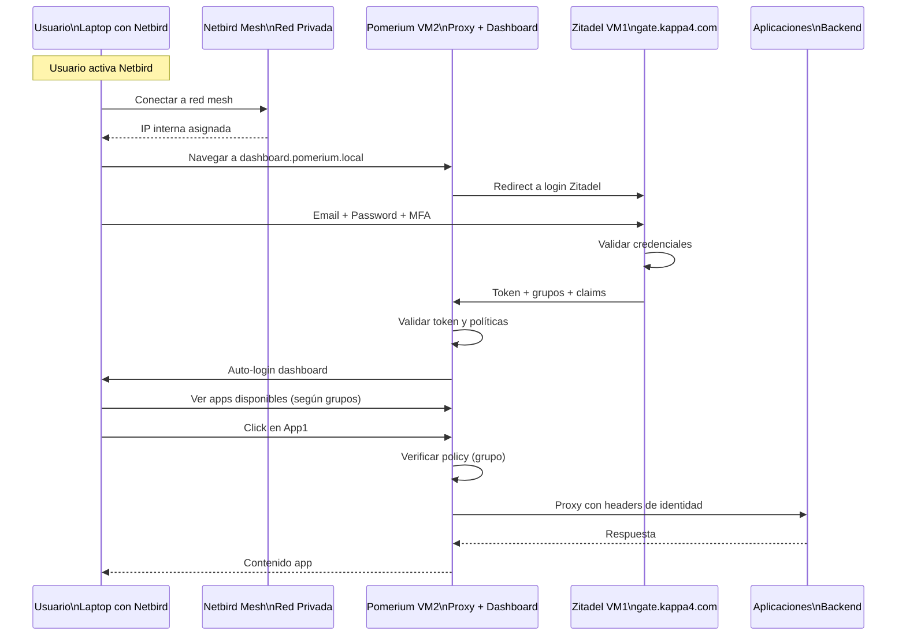

# Neoprod — Zero Trust Remote Access Platform  
**Pomerium + Zitadel + Netbird + TSplus + GCP + Terraform + GitHub Actions**

Este repositorio contiene la infraestructura, documentación y automatización de la plataforma **Neoprod**, diseñada para ofrecer acceso seguro a escritorios Windows y aplicaciones remotas usando **Zero Trust**, sin exponer puertos, con MFA, SSO, túneles cifrados y flujo operativo seguro.

## Nueva Integración: Pomerium + Zitadel + Netbird

Este repositorio ahora incluye una configuración completa de **Pomerium** como proxy Zero Trust integrado con:
- **Zitadel** (VM1) como proveedor de identidad OIDC con SSO y MFA
- **Netbird** como red mesh cifrada para conectividad privada
- **Pomerium** (VM2) como gateway de aplicaciones con dashboard automático

Ver [documentación completa de integración](docs/pomerium-zitadel-integration.md).

---

# 📌 Objetivo

Proveer acceso remoto seguro a aplicaciones y servicios protegido mediante:

- 🔐 **Zero Trust Access con Pomerium**
- 🔐 **Autenticación SSO + MFA (Zitadel)**
- 🔐 **Overlay Mesh cifrado (Netbird)**
- 🔐 **Dashboard automático basado en roles y grupos**
- 🌐 **Infraestructura privada en GCP (sin IPs públicas en servicios)**
- ⚙️ **Despliegue automatizado con Terraform desde GitHub Actions**

Todo corriendo en **una capa segura dentro de una VPC privada**, sin exponer aplicaciones backend ni servicios al internet público.

### Arquitecturas Soportadas

1. **Pomerium + Zitadel + Netbird** (Configuración actual)
   - Autenticación con Zitadel OIDC
   - Autorización basada en grupos de Zitadel
   - Red privada con Netbird mesh
   - Dashboard de aplicaciones con auto-login
   - Ver: [docs/pomerium-zitadel-integration.md](docs/pomerium-zitadel-integration.md)

2. **Firezone + Netbird + Authentik** (Configuración legacy)
   - Para acceso a Windows TSplus
   - Ver: [docs/arquitectura.md](docs/arquitectura.md)

---

# 🧱 Arquitectura

## 🔐 Diagrama Zero Trust - Pomerium + Zitadel + Netbird



## 🧱 Arquitectura de Infraestructura

```mermaid
flowchart TD
    A[Usuario\nLaptop] -->|Netbird Client| B[Netbird Mesh\nRed Cifrada]
    
    subgraph GCP ["GCP - VPC Privada"]
        subgraph VM1["VM1 - gate.kappa4.com"]
            C[Zitadel\nOIDC + SSO + MFA]
            D[Netbird Management\n+ Signal Server]
        end
        
        subgraph VM2["VM2 - Sin IP Pública"]
            E[Pomerium\nProxy + Dashboard]
        end
        
        F[Apps Backend\nSin exposición pública]
    end
    
    B --> D
    B --> E
    A -->|HTTPS público| C
    E --> C
    E --> F
    
    style VM2 fill:#f9f,stroke:#333
    style E fill:#bbf,stroke:#333
