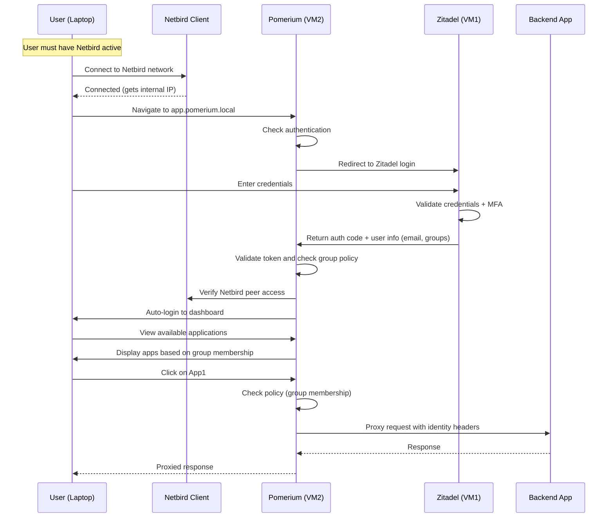

# Pomerium + Zitadel + Netbird Zero Trust Integration

## Architecture Overview

This integration implements a comprehensive Zero Trust security model combining:

- **Zitadel** (VM1 at https://gate.kappa4.com): Identity Provider (IdP) with SSO and MFA
- **Netbird**: Secure mesh network overlay for private connectivity
- **Pomerium** (VM2): Zero Trust proxy and application gateway

## Flow Diagram



## Access Flow

1. **Network Layer (Netbird)**
   - User must have Netbird client active on their laptop
   - Netbird connects to management server on VM1
   - User gets assigned a Netbird internal IP (e.g., 100.64.0.x)
   - DNS resolution through Netbird Magic DNS

2. **Authentication Layer (Zitadel)**
   - User navigates to `https://authenticate.pomerium.local` (only accessible via Netbird)
   - Pomerium redirects to Zitadel at `https://gate.kappa4.com`
   - User enters email and password
   - Zitadel enforces MFA (TOTP, WebAuthn, etc.)
   - Zitadel validates credentials and returns:
     - User identity (email, name, user ID)
     - Group memberships
     - Access token
     - ID token

3. **Authorization Layer (Pomerium)**
   - Pomerium receives token from Zitadel
   - Validates token signature and claims
   - Extracts user groups from token
   - Checks group membership against route policies
   - Creates Pomerium session
   - Redirects to dashboard

4. **Application Access**
   - Dashboard shows only apps user has access to (based on groups)
   - User clicks on application
   - Pomerium checks policy for that route
   - If authorized, proxies request to backend
   - Passes identity headers to backend:
     - `X-Pomerium-Claim-Email`
     - `X-Pomerium-Claim-Groups`
     - `X-Pomerium-Claim-User`

## Infrastructure Setup

### VM1 (Zitadel + Netbird Management)
- **Public Domain**: gate.kappa4.com → Public IP
- **Services**:
  - Zitadel OIDC Provider
  - Netbird Management Server
  - Netbird Signal Server
- **Netbird IP**: e.g., 100.64.0.1

### VM2 (Pomerium Proxy)
- **No Public IP**: Zero Trust - access only via Netbird
- **Services**:
  - Pomerium (all-in-one mode)
  - Netbird Client (peer)
- **Netbird IP**: e.g., 100.64.0.2
- **Internal DNS**:
  - authenticate.pomerium.local → 100.64.0.2
  - dashboard.pomerium.local → 100.64.0.2
  - *.pomerium.local → 100.64.0.2

## Configuration Steps

### 1. Configure Zitadel (VM1)

#### Create OIDC Application
1. Log into Zitadel at https://gate.kappa4.com
2. Navigate to **Applications** → **New**
3. Configure:
   ```
   Name: Pomerium
   Type: Web Application
   Auth Method: POST
   Redirect URIs:
     - https://authenticate.pomerium.local/oauth2/callback
     - https://dashboard.pomerium.local/oauth2/callback
   Post Logout URIs:
     - https://authenticate.pomerium.local/
   Grant Types: Authorization Code
   Response Types: Code
   ```
4. Enable scopes:
   - `openid`
   - `profile`
   - `email`
   - `groups` (custom scope for group membership)

5. Save and note down:
   - Client ID
   - Client Secret

#### Create User Groups
Create groups in Zitadel for authorization:
```
- pomerium-users (basic access)
- app1-users (access to App1)
- app2-users (access to App2)
- admin (admin access)
```

#### Assign Users to Groups
Assign users to appropriate groups based on their access requirements.

### 2. Configure Netbird (VM1 & VM2)

#### On VM1 (Management Server)
Netbird should already be configured from previous setup.

#### On VM2 (Pomerium Proxy)
1. Install Netbird (done by bootstrap script)
2. Generate setup key from Netbird dashboard on VM1
3. Connect VM2 to Netbird:
   ```bash
   netbird up --setup-key <SETUP_KEY_FROM_VM1>
   ```

#### Configure Netbird ACLs
In Netbird dashboard, configure access policies:
- Allow users in specific groups to reach VM2 (Pomerium)
- Configure peer groups for application access

#### Configure DNS
Use Netbird Magic DNS or configure `/etc/hosts`:
```
100.64.0.2  authenticate.pomerium.local
100.64.0.2  dashboard.pomerium.local
100.64.0.2  app1.pomerium.local
100.64.0.2  app2.pomerium.local
100.64.0.2  admin.pomerium.local
```

### 3. Configure Pomerium (VM2)

#### Update Environment Variables
Edit `/opt/pomerium/.env`:
```bash
ZITADEL_CLIENT_ID=<your-client-id-from-zitadel>
ZITADEL_CLIENT_SECRET=<your-client-secret-from-zitadel>

# These are auto-generated by bootstrap script
POMERIUM_SIGNING_KEY=<auto-generated>
POMERIUM_COOKIE_SECRET=<auto-generated>
POMERIUM_SHARED_SECRET=<auto-generated>
```

#### Copy Configuration Files
```bash
# Copy docker-compose.yml
cp configs/pomerium/docker-compose.yml /opt/pomerium/

# Copy config.yaml
cp configs/pomerium/config.yaml /opt/pomerium/config/
```

#### Configure Routes
Edit `/opt/pomerium/config/config.yaml` to add your applications:

```yaml
routes:
  - from: https://myapp.pomerium.local
    to: http://backend.internal:8080
    policy:
      - allow:
          groups:
            is: myapp-users
    show_in_routes_portal: true
```

#### Start Pomerium
```bash
systemctl start pomerium
# Or
/opt/pomerium/start.sh
```

## Policy Configuration

### Group-Based Access Control

Policies in Pomerium use the groups claim from Zitadel token:

```yaml
# Allow users in specific group
policy:
  - allow:
      groups:
        is: app1-users

# Allow multiple groups
policy:
  - allow:
      or:
        - groups:
            is: app1-users
        - groups:
            is: admin

# Require authentication + specific group
policy:
  - allow:
      and:
        - authenticated_user: true
        - groups:
            is: app1-users
```

### Advanced Policies

```yaml
# Domain-based access
policy:
  - allow:
      email:
        ends_with: "@company.com"

# Specific users
policy:
  - allow:
      email:
        is: admin@company.com

# Combine multiple conditions
policy:
  - allow:
      and:
        - authenticated_user: true
        - groups:
            is: developers
        - email:
            ends_with: "@company.com"
```

## User Experience

### First-Time Access
1. User opens laptop and connects to Netbird
2. Navigates to `https://dashboard.pomerium.local`
3. Redirected to Zitadel login page
4. Enters email and password
5. Completes MFA challenge
6. Redirected back to Pomerium dashboard
7. Sees list of applications they have access to

### Subsequent Access
1. User already authenticated (cookie valid)
2. Navigates to any app (e.g., `https://app1.pomerium.local`)
3. Pomerium checks policy (group membership)
4. If authorized, proxies to backend
5. Backend receives identity headers

### Session Management
- Session duration: 14 hours (configurable)
- Re-authentication required after expiration
- Can force logout from dashboard
- Signout redirects to Zitadel

## Security Features

### Network Security
- ✅ No public IP on Pomerium VM
- ✅ Access only through Netbird mesh
- ✅ WireGuard encryption for all traffic
- ✅ No exposed ports to internet

### Authentication Security
- ✅ SSO with Zitadel
- ✅ MFA enforced at IdP level
- ✅ Token-based authentication
- ✅ Secure token validation

### Authorization Security
- ✅ Group-based access control
- ✅ Route-level policies
- ✅ Per-application authorization
- ✅ Identity forwarding to backends

### Transport Security
- ✅ TLS/HTTPS everywhere
- ✅ Secure cookies (HttpOnly, Secure, SameSite)
- ✅ HSTS headers
- ✅ Security headers (X-Frame-Options, etc.)

## Monitoring and Troubleshooting

### Check Pomerium Status
```bash
# View logs
/opt/pomerium/logs.sh

# Check container status
docker ps

# Restart Pomerium
/opt/pomerium/restart.sh
```

### Check Netbird Connectivity
```bash
# Check Netbird status
netbird status

# Ping VM1 from VM2
ping <VM1_NETBIRD_IP>

# Check routes
netbird routes list
```

### Debug Authentication Issues
1. Check Zitadel application configuration
2. Verify redirect URIs match exactly
3. Check client ID and secret in `.env`
4. Review Pomerium logs for OIDC errors
5. Verify user is in required groups

### Debug Authorization Issues
1. Check policy configuration in `config.yaml`
2. Verify group claim is present in token
3. Check Pomerium logs for policy evaluation
4. Confirm user is member of required group in Zitadel

## Maintenance

### Updating Configuration
```bash
# Edit config
nano /opt/pomerium/config/config.yaml

# Restart to apply changes
/opt/pomerium/restart.sh
```

### Rotating Secrets
```bash
# Generate new secrets
head -c32 /dev/urandom | base64

# Update .env file
nano /opt/pomerium/.env

# Restart Pomerium
/opt/pomerium/restart.sh
```

### Certificate Management
For production, use proper certificates:
```bash
# Let's Encrypt (if using public domain)
certbot certonly --standalone -d authenticate.pomerium.local

# Or use internal CA
# Copy certs to /opt/pomerium/certs/
```

## References

### Pomerium Documentation
- [Service URLs](https://www.pomerium.com/docs/reference/service-urls)
- [Authentication](https://www.pomerium.com/docs/capabilities/authentication)
- [Authorization](https://www.pomerium.com/docs/capabilities/authorization)
- [Getting User Identity](https://www.pomerium.com/docs/capabilities/getting-users-identity)
- [Routes Portal](https://www.pomerium.com/docs/capabilities/routes-portal)
- [Policy Reference](https://www.pomerium.com/docs/reference/routes/policy)
- [Architecture](https://www.pomerium.com/docs/internals/architecture)
- [Identity Provider Settings](https://www.pomerium.com/docs/reference/identity-provider-settings)
- [Routes Configuration](https://www.pomerium.com/docs/reference/routes)

### Zitadel Documentation
- [OIDC Configuration](https://zitadel.com/docs/guides/integrate/login/oidc)
- [Custom Claims](https://zitadel.com/docs/guides/manage/customize/behavior)

### Netbird Documentation
- [Netbird Setup](https://netbird.io/docs/getting-started/quickstart)
- [ACL Configuration](https://netbird.io/docs/how-to/access-control)
